<div align="center">
<!-- ANIMATED HEADER -->


<!-- DYNAMIC TYPING -->
<a href="https://github.com/rishiithakur">

</a>

<!-- SOCIAL BADGES -->
<p align="center">
  <a href="https://instagram.com/i.rishii.thakur">
    
  </a>
  &nbsp;
  <a href="mailto:rishu9882876884@gmail.com">
    
  </a>
  &nbsp;
  <a href="mailto:RishabhThakur@shinesoft.co.in">
    
  </a>
  &nbsp;
  
</p>

<br/>

<!-- PROFILE SNAKE ANIMATION -->
<picture>
  <source media="(prefers-color-scheme: dark)" srcset="https://raw.githubusercontent.com/rishiithakur/rishiithakur/output/dist/github-snake-dark.svg"/>
  <source media="(prefers-color-scheme: light)" srcset="https://raw.githubusercontent.com/rishiithakur/rishiithakur/output/dist/github-snake.svg"/>
  
</picture>

</div>

---

## `WHO AM I`
<div align="center">
  
</div>

> *"From World Bank infrastructure to pixel-perfect UIs — engineering with purpose, precision, and scale."*

---

## ⚡ What I Do

<div align="center">

| 🤖 AI & Automation | 🌍 GIS & Remote Sensing | 🌐 Web & Dashboards | 📊 Data Systems |
|:---:|:---:|:---:|:---:|
| Chatbots · LLM Pipelines | ArcGIS Pro · GEE · QGIS | React · JS · WordPress | Power BI · SQL · ETL |
| Copilot Integration | Hydrology Mapping | Enterprise UIs | Statistical Analysis |
| Decision Support AI | LULC · ET · Water Bodies | Esri Web Apps | DB Schema Design |

</div>

---

## 🏗️ Professional Experience

<details open>
<summary><b>🏢 IT Solutions Specialist & GIS Analyst — SHINE Soft Pvt. Ltd.</b></summary>
<br/>

**Projects under World Bank Funding:**

🔷 **DRIP-II** — Dam Rehabilitation & Improvement Project
- Built AI-powered decision support systems for dam safety operations
- Developed GIS-based spatial databases and risk mapping tools
- Integrated MIS platforms with World Bank STEP procurement portal

🔷 **National Hydrology Project (NHP)**
- Automated hydrological data pipelines using Python + GEE
- Created geospatial dashboards for water body monitoring
- Performed LULC classification, ET estimation & TBP analysis

</details>

---

## 🧰 Tech Arsenal

### ⚡ AI & Automation
<p>
  
  
  
  
  
</p>

### 🌐 Web & UI/UX
<p>
  
  
  
  
  
  
  
</p>

### 🌍 GIS & Remote Sensing
<p>
  
  
  
  
  
</p>

### 📊 Data & Analytics
<p>
  
  
  
  
</p>

### 🗄️ Databases
<p>
  
  
  
  
</p>

### ☁️ Cloud, DevOps & Tools
<p>
  
  
  
  
  
  
  
  
</p>

---


<div align="center">

## 📊 GitHub Intelligence

<table>
  <tr>
    <td align="center" width="50%">
      
    </td>
    <td align="center" width="50%">
      
    </td>
  </tr>
  <tr>
    <td colspan="2" align="center">
      <br/>
      
    </td>
  </tr>
</table>

</div>

---

## 🏆 Achievements

<div align="center">


</div>

---

## 📈 Contribution Activity

<div align="center">

[](https://github.com/rishiithakur)

</div>

---

## 🎯 Current Focus

<div align="center">
  
</div>


## 💡 Dev Philosophy

<div align="center">

```
   Systems should be as intelligent as the problems they solve.
   Design should be as clean as the data behind it.
   Code should be as precise as the geospatial coordinates it maps.
```

</div>

---

## 📬 Let's Build Something

<div align="center">

**Open to freelance projects · AI integrations · GIS solutions · Premium web builds**

<br/>

<a href="mailto:rishu9882876884@gmail.com">
  
</a>
&nbsp;
<a href="https://instagram.com/i.rishii.thakur">
  
</a>

</div>

---

<div align="center">


<sub>⭐ If you find my work valuable, consider starring my repos — it fuels the mission.</sub>

</div>
